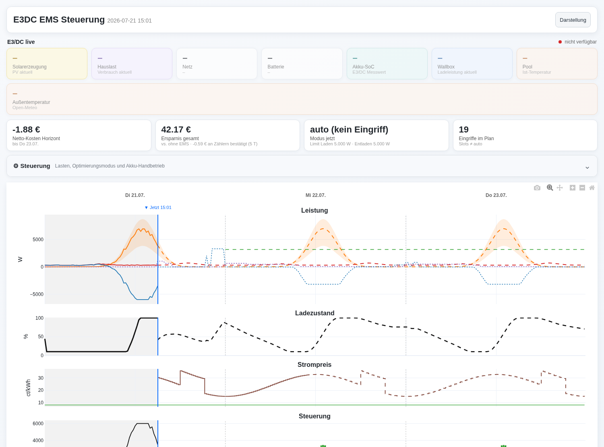

# EMS – Energy Management System

Kostenoptimale Steuerung von Haus-Akku, PV und Fahrzeug. Läuft als
Python-Dienst auf einem Raspberry Pi (Raspberry Pi OS **Trixie** / Debian 13),
liest Eingangsdaten aus **InfluxDB** (1.x oder 2.x), berechnet per **MILP** die
optimale Steuertabelle für 48 h und gibt die Steuerbefehle per **MQTT** an
Homey aus. Zusätzlich werden alle Zukunftswerte (Steuerbefehle, prognostizierte
SoCs, Zustände) zurück in InfluxDB geschrieben.

## Architektur

```
InfluxDB  ──►  EMS (Pi, Python)                              ──►  MQTT  ──►  Homey
(1.x/2.x)      1. Verbrauchsprognose (72h, Ähnliche-Tage)         (Sollwerte)
               2. Eingangsdaten lesen (Preis/PV-Vorhersage,      ──►  InfluxDB
                  aktueller Haus-/Auto-SoC)                            (Steuertabelle +
               3. MILP-Optimierung (48h) → Steuertabelle              Prognose-SoCs)
               4. MQTT-Ausgabe an Homey
               5. Writeback in InfluxDB
               6. Dashboard (HTML)
```

Warum Pi-Dienst und nicht Homey-App: Die MILP-Optimierung (192 Slots) und die
Historien-Prognose brauchen Python-Bibliotheken und Rechenleistung, die in der
Homey-App-Sandbox nicht sinnvoll verfügbar sind. Homey erhält nur die fertigen
Steuerbefehle per MQTT.

## Module

| Datei | Aufgabe |
|-------|---------|
| `ems/config.py` | YAML-Konfiguration laden/validieren (typisierte Dataclasses) |
| `ems/influx.py` | InfluxDB-Abstraktion 1.x (InfluxQL) / 2.x (Flux), Lesen/Schreiben, 15-min-Resampling |
| `ems/forecast.py` | Hausverbrauchs-Prognose per Ähnliche-Tage-Mittelung (Wochentag/Feiertag/Monat/Jahreszeit/Temperatur, Rezenz-Gewichtung) |
| `ems/optimizer.py` | MILP-Optimierer (PuLP/CBC): Steuertabelle 48 h |
| `ems/homey_mqtt.py` | MQTT: Steuerbefehle an Homey, Status/Last-Will, Alerts, Kommandos |
| `ems/savings.py` | Ersparnis-Tracking: Ist-Kosten vs. simulierte "Ohne-EMS"-Baseline |
| `ems/dashboard.py` | Interaktives HTML-Dashboard (heute + Vorhersage + Steuerbefehle) |
| `ems/rscp.py` | Optionale direkte E3DC-Anbindung (RSCP/pye3dc): Live-Werte, Historie, Steuerung |
| `ems/main.py` | Orchestrierung + CLI (`--loop` für Dauerbetrieb), systemd-Watchdog |
| `tests/` | pytest-Suite (E2E synthetisch, Optimierer-Randfälle, Prognose, Ersparnis) |

## Eingangssignale (aus InfluxDB)

Hausverbrauch, Strompreis, Haus-Akku-SoC, PV-Erzeugung, PV-Vorhersage,
optional Fahrzeug-SoC, optional Einspeisevergütung. Strompreis und PV-Vorhersage
werden auch für die Zukunft gelesen. Alle Leistungen in **W**, Preise in
**ct/kWh**, Energien in **Wh**. Berechnung auf **15-min-Slots**.

Die Zuordnung Signal → Measurement/Field wird in `config.yaml` unter
`influxdb.signals` festgelegt und an die eigene InfluxDB-Struktur angepasst.

## Optional: direkte E3DC-Anbindung (RSCP)

Statt (oder zusätzlich zu) InfluxDB/MQTT kann das EMS den E3DC direkt per RSCP
ansprechen (Bibliothek `pye3dc`, `pip install pye3dc`). Aktivierung unter
`config.yaml` → `e3dc_rscp` (Default aus, ändert sonst nichts):

- **`read_live`**: aktueller SoC/PV/Last direkt vom Gerät (frischer als der
  DB-Umweg) für Anfangs-SoC und Slot-0-Anker – mit Fallback auf InfluxDB.
- **`control_enabled`**: steuert den Speicher direkt per RSCP (zusätzlich zur
  MQTT-Ausgabe an Homey, die parallel weiterläuft). **Greift real ein** – gegen
  echte Hardware verifiziert:
  - *Netzladen* (`batt_grid_charge_w>0`) → `EMS_REQ_SET_POWER` Mode 3, Wert =
    geplante Gesamt-Ladeleistung; ein Watchdog-Thread sendet alle 5 s neu
    (sonst fällt der E3DC nach 10 s auf auto). Netz-Entladen (Mode 4) analog,
    nur bei `allow_grid_discharge` – noch nicht ohne PV gegengeprüft.
  - *reine Lade-/Entlade-Begrenzung* (Peak-Shaving, Sperren) → persistente
    Limits (`set_power_limits`), kein Watchdog.
  - Beim Beenden schaltet der Dienst aktiv auf auto (Mode 0) zurück; stirbt der
    Prozess, tut es der 10-s-Watchdog des E3DC selbst (Fail-safe).
- **`history_source`**: die Verbrauchsprognose liest die 15-min-Hauslast aus
  einer lokalen SQLite (`ems/local_history.py`) statt aus der InfluxDB. Die
  Hauslast je Fenster wird aus der E3DC-Energiebilanz berechnet
  (`PV + Akku-Entladung + Netzbezug − Akku-Ladung − Einspeisung`; gegen
  InfluxDB verifiziert: Bias ~−44 W, Fenster-Rauschen mittelt sich in der
  Ähnliche-Tage-Prognose heraus). Ablauf:
  1. **Einmaliger Backfill** (Hintergrund): `python rscp_import.py --config
     config.yaml --days 730` – 1 RSCP-Aufruf je 15-min-Fenster (2 Jahre
     ≈ 70 000, mehrere Stunden). Danach `history_source: true` setzen.
  2. **Zyklisch**: der Dienst führt vor jeder Prognose (alle 15 min) die neuen
     Fenster nach – idempotent und auf 3 Tage gekappt, sodass ein Lauf nie den
     ganzen Backfill zieht und kurze Lücken sich selbst heilen. Nach einem
     längeren Ausfall (> 3 Tage) den Backfill einmal manuell erneut laufen
     lassen.

  Damit kann die Verbrauchs-Historie ohne InfluxDB/openHAB laufen.
- **Ist-Werte lokal** (`ems/local_history.py`, Tabelle `actuals`): bei aktivem
  `history_source` protokolliert der Dienst jeden Zyklus den E3DC-Live-Snapshot
  (SoC/PV/Last/Netz/Akku). Alle Funktionen, die bisher die jüngsten Ist-Werte
  aus der InfluxDB lasen – Intraday-Korrektur, Ersparnis-Tracking, Drift-Monitor
  und die Ist-Kurven im Dashboard – lesen dann aus dieser lokalen Tabelle
  (zentrale Weiche `read_actual_signal`).
- **Noch InfluxDB-gebunden:** Preis, PV-Vorhersage und Temperatur kann der E3DC
  nicht liefern – deren Direktabruf aus den Quellen ist der nächste
  Standalone-Schritt.

Hinweis: Nicht gegen echte Hardware getestet. Feldnamen-Mapping (`_map_live`)
und Vorzeichen (`grid_sign`/`batt_sign`) ggf. am Gerät anpassen; die Logik ist
mit gemocktem Client getestet (`tests/test_rscp.py`).

## Konfigurierbare Anlagenwerte

Haus-Akku-Kapazität, Auto-Akku-Kapazität, Haus-Akku max. DC-Ladeleistung,
Haus-Akku max. AC-Ladeleistung, Haus-Akku max. Entladeleistung, Wechselrichter
max. AC-Leistung, Auto max./min. Ladeleistung, min./max. Haus-SoC, min. Auto-SoC,
Ziel-Auto-SoC + Abfahrtzeit, Einspeisevergütung (fest oder aus DB). Siehe
`config.example.yaml`.

## Steuergrößen (Optimierung)

Pro 15-min-Slot über 48 h:
- Haus-Akku **DC-Ladeleistung** (nur aus PV)
- Haus-Akku **AC-Ladeleistung** (aus dem Netz)
- Haus-Akku **DC-Entladeleistung**
- **Auto-Ladeleistung** (semikontinuierlich: 0 oder zwischen Min und Max)

Nebenbedingungen: SoC-Grenzen Haus/Auto, Leistungsgrenzen, Wechselrichter-
Durchsatz, **kein gleichzeitiges Laden/Entladen** (per Binärvariablen erzwungen),
**Auto-Ziel-SoC zur Abfahrtzeit**. Ziel: Minimierung der Netto-Stromkosten
(Import·Preis − Export·Einspeisevergütung) inkl. Terminalwert des Akku-Inhalts.

## Installation auf dem Pi (Trixie)

```bash
sudo apt update
sudo apt install -y python3 python3-venv python3-pip coinor-cbc mosquitto mosquitto-clients

sudo mkdir -p /opt/ems && sudo chown $USER /opt/ems
# Projektdateien nach /opt/ems kopieren (ems/, requirements.txt, config.example.yaml ...)
cd /opt/ems
python3 -m venv .venv
. .venv/bin/activate
pip install -r requirements.txt        # oder: requirements.lock (exakt getestete Versionen)

cp config.example.yaml config.yaml
# config.yaml anpassen: InfluxDB-Version/Zugang, Signal-Mapping, Anlagenwerte, MQTT

# Einmaliger Testlauf:
python -m ems.main --config config.yaml --log-level INFO
```

> Hinweis: PuLP bringt einen CBC-Solver mit; das System-Paket `coinor-cbc` ist
> optional als robuste Alternative.

### Als Dienst (systemd)

```bash
sudo useradd -r -s /usr/sbin/nologin ems 2>/dev/null || true
sudo chown -R ems:ems /opt/ems
sudo cp ems.service ems-kalibrierung.service ems-kalibrierung.timer \
        ems-backup.service ems-backup.timer /etc/systemd/system/
sudo systemctl daemon-reload
sudo systemctl enable --now ems.service ems-kalibrierung.timer ems-backup.timer
journalctl -u ems -f
```

Der Dienst rechnet im Intervall `general.run_interval_minutes` (Standard 15 min)
neu. Er läuft gehärtet als Benutzer `ems` (Port 80 über
`CAP_NET_BIND_SERVICE`, Schreibzugriff nur auf `/opt/ems`) und mit
**systemd-Watchdog**: bleibt das Lebenszeichen 35 min aus (Prozess hängt),
startet systemd den Dienst neu.

### Backup

`ems-backup.timer` sichert wöchentlich die unversionierten Dateien
(`config.yaml` mit Zugangsdaten, Kalibrierprofile, Ersparnis-Status) per
[backup.sh](backup.sh) nach `/opt/ems/backup` (letzte 8 Stände). **Wichtig:**
Das lokale Ziel schützt nicht vor einem Ausfall des Datenträgers – für echte
Sicherheit in `ems-backup.service` ein externes Ziel setzen
(`Environment=EMS_BACKUP_DIR=/mnt/nas/ems-backup`).

## Homey-Anbindung (MQTT)

Das EMS publiziert bei jedem Zyklus die Sollwerte des laufenden Slots:

```
ems/setpoint/batt_charge_limit_w      Ladelimit (Hardware-Max = frei laufen)
ems/setpoint/batt_discharge_limit_w   Entladelimit (Hardware-Max = frei laufen)
ems/setpoint/batt_grid_charge_w       Netzladen erzwingen (Akku <- Netz)
ems/setpoint/batt_grid_discharge_w    Netz-Entladen (Akku -> Netz)
ems/setpoint/charge_limited           true/false
ems/setpoint/discharge_limited        true/false
ems/setpoint/car_charge_w             z.B. 4000
ems/setpoint/mode                     "auto" | "grid_charge" | "hold" | ...
ems/setpoint/updated                  ISO-Zeitstempel des Slots
ems/schedule                          komplette 48h-Tabelle als JSON (retained)
ems/status                            "online" | "offline" (retained, Last Will)
ems/alert                             Störungen als JSON {level, message, time}
```

Eingehende Kommandos (von Homey an das EMS):

```
ems/cmd/recalc          sofortige Neuberechnung anstoßen (Payload egal)
ems/cmd/car_boost       "1"/"0": Auto sofort mit Max-Leistung laden, bis der
                        Ziel-SoC erreicht ist (überschreibt car_charge_w)
ems/cmd/car_departure_time  "HH:MM": Abfahrtzeit setzen; ""/"default" =
                        Konfigwert; "off"/"urlaub" = Urlaubsmodus: keine
                        Abfahrten, der Ziel-SoC wird nicht mehr erzwungen
ems/cmd/car_target_soc  Ziel-SoC in % (1..100); ""/"default" = Konfigwert
ems/cmd/min_soc         Haus-Akku Minimum-SoC in % (z.B. Reserve vor Sturm/
                        Stromausfall hochsetzen); ""/"default" = Konfigwert
ems/cmd/max_soc         Haus-Akku Maximum-SoC in % (Akku schonen);
                        ""/"default" = Konfigwert
```

Die Parameter-Kommandos in Homey **mit Retain** publizieren, dann überstehen
sie einen EMS-Neustart (der Broker liefert sie beim Reconnect erneut aus).
Inkonsistente Grenzen (min ≥ max) werden verworfen. Die aktuell wirksamen
Werte meldet das EMS unter `ems/vehicle/departure_time`,
`ems/vehicle/target_soc_percent`, `ems/battery/min_soc_percent` und
`ems/battery/max_soc_percent` zurück.

`ems/alert` meldet z.B. eine nicht-optimale Optimierung (Fallback aktiv) oder
einen fehlgeschlagenen Zyklus – ideal für einen Homey-Push-Benachrichtigungs-Flow.

In Homey die **MQTT Client**-App auf diese Topics abonnieren und die Werte per
Flow auf die Geräte-Capabilities (Ladeleistung etc.) schreiben.

**Fail-safe:** Die Sollwerte werden ohne Retain-Flag publiziert – fällt das EMS
aus, hält der Broker keine veralteten Steuerbefehle vor. Zusätzlich hält das
EMS im Loop-Betrieb eine stehende MQTT-Verbindung mit **Last Will**: stirbt der
Prozess (Absturz, Stromausfall, Netzverlust), setzt der Broker selbst
`ems/status = offline`. Empfohlener Watchdog-Flow in Homey: Wenn `ems/status`
auf `offline` wechselt (oder `ems/setpoint/updated` länger als ~35 min kein
Update bekommt), alle Limits auf Hardware-Maximum setzen (Eigenverbrauchs-
Automatik des E3DC).

## Writeback in InfluxDB

Zusätzlich werden geschrieben (Measurements konfigurierbar unter
`influxdb.outputs`):
- `ems_load_forecast` – prognostizierter Hausverbrauch (72 h)
- `ems_control` – Steuerbefehle je Slot (48 h)
- `ems_prediction` – prognostizierte Haus-/Auto-SoCs, Netz, Slot-Kosten (48 h)
- `ems_savings` – Ersparnis-Tracking je abgeschlossenem Slot (s.u.)

## Ersparnis-Tracking

Für jeden abgeschlossenen Slot vergleicht das EMS die **tatsächlichen**
Netzkosten (gemessener Netzbezug/-einspeisung × Preis) mit einer Simulation,
was der E3DC **ohne EMS** im reinen Eigenverbrauchsmodus getan hätte (eigener
hypothetischer Akku-SoC wird fortgeführt, Zustand in `savings_state.json`).
Die kumulierte Differenz erscheint im Dashboard-Titel („Ersparnis gesamt")
und je Slot in `ems_savings` – wird sie dauerhaft negativ, stimmt etwas am
Modell. Benötigt die Signale `pv_generation`, `house_consumption`,
`grid_power` (positiv = Bezug) und `electricity_price`.

## Dashboard



Nach jedem Lauf entsteht `dashboard.html` (Pfad konfigurierbar, im Loop-Betrieb
per HTTP auf Port 80 erreichbar, Auto-Reload nach jeder Neuberechnung):

- **KPI-Kacheln**: Netto-Kosten Horizont, Ersparnis gesamt, Akku-SoC,
  Modus jetzt (mit Limits), Eingriffe im Plan
- **Leistung** (PV mit Solcast-p10–p90-Band, Verbrauch, Netz, Einspeise-Linie;
  Ist durchgezogen, Prognose gestrichelt), **Ladezustand**, **Strompreis** +
  Einspeisevergütung, **Steuerung** (Ladebefehle, Abregelung, Ist-Akkuleistung)
- **Modus-Zeitleiste**: Eingriffe als Farbstreifen (auto/Peak-Laden/gedrosselt/
  gesperrt/Netzladen/Netz-Entladen) mit Legende und Hover-Klartext
- Vergangenheit grau hinterlegt, Tagesgrenzen mit Wochentag, Jetzt-Linie

Die interaktive Beispielausgabe (Bild oben, **synthetische Daten**) liegt als
[dashboard_beispiel.html](dashboard_beispiel.html) bei – regenerierbar mit
`python beispiel_dashboard.py` (nutzt Plotly vom CDN, das produktive Dashboard
läuft dagegen offline mit lokalem `plotly.min.js`). Screenshot erneuern:

```bash
chromium --headless --no-sandbox --hide-scrollbars --window-size=1500,1110 \
  --screenshot=dashboard_beispiel.png dashboard_beispiel.html
```

## Test

```bash
pytest                            # komplette Suite
python -m tests.test_synthetic    # nur der End-to-End-Lauf
```

Ohne InfluxDB/MQTT lauffähig. Abgedeckt:
- `tests/test_synthetic.py` – End-to-End: Prognose, Optimierung (Lösbarkeit +
  Nebenbedingungen), Fallback bei ungültigen Eingaben, Dashboard-Erzeugung.
- `tests/test_optimizer.py` – Randfälle: peak/asap-Strategie, negative Preise,
  Netz-Entlade-Arbitrage, unerreichbarer Auto-Ziel-SoC (Fallback),
  DST-Umstellungstage (92/100 Slots).
- `tests/test_forecast.py` – Rezenz-Gewichtung, Datenlücken, leere Historie.
- `tests/test_validate.py` – Invarianten-Validator (`ems/validate.py`).
- `tests/test_fuzz.py` – Fuzz (zufällige Szenarien × Invarianten) + metamorphe
  Relationen (Preis-Offset, höhere Vergütung, mehr PV).

## Modell-Prüfung: Invarianten & Backtest

Modellfehler zeigen sich oft nur als „das sieht komisch aus" im Dashboard.
Zwei Werkzeuge machen die Suche systematisch:

- **`ems/validate.py`** – prüft einen fertigen Plan gegen Invarianten, die
  immer gelten müssen (SoC-/Leistungsgrenzen, Energiebilanz, kein
  gleichzeitiges Laden/Entladen, DC-Laden nur aus PV-Überschuss, kein Entladen
  bei PV-Überschuss, Einspeisebegrenzung, **Ausführbarkeit**: die an Homey
  gesendeten Befehle passen zu den geplanten Flüssen) plus ökonomische
  Plausibilität (Plan nie teurer als die Ohne-EMS-Baseline). Läuft in Tests,
  im Backtest UND live: nach jeder Optimierung, mit Anzeige im Dashboard
  (Banner + Kachel) und Alarm auf `ems/alert`.
- **`ems/drift.py`** – Predicted-vs-Actual: vergleicht je Lauf den
  prognostizierten mit dem gemessenen Haus-SoC (MAE in Prozentpunkten ->
  Measurement `ems_drift`), Warnung über der Schwelle. Deckt Modellfehler auf,
  die kein einzelner Plan zeigt (Wirkungsgrade, Standby, Alterung).
- **Debug-Report-Button** (Dashboard, nur bei `report.enabled: true`): lädt bei
  einer Implausibilität den Schnappschuss des letzten Laufs (Eingaben + Plan,
  ohne Zugangsdaten) herunter und öffnet das Mailprogramm vorausgefüllt an
  `report.mail_to` – die JSON hängt man manuell an. Damit lässt sich der Fehler
  offline im Backtest/Optimizer exakt nachstellen. Kein SMTP-Server nötig.
- **`backtest.py`** – spielt vergangene Tage aus der InfluxDB durch den
  Optimierer (perfekte Voraussicht) und prüft jeden Plan. Findet Modellfehler
  über Monate echter Daten in Minuten, statt monatelang zuzuschauen:

  ```bash
  python backtest.py --config config.yaml --days 120
  python backtest.py --config config.yaml --start 2026-01-01 --end 2026-03-01
  ```

  Schreibt nichts in die DB. Nach jeder Modelländerung als Regressions-Sweep
  laufen lassen: erwartet werden 0 Fehler und 0 (terminalwert-bereinigt)
  negative Ersparnis-Tage.

## Modellannahmen

- PV ist am DC-Bus verfügbar; DC-Laden reduziert die an den Wechselrichter
  geführte PV-Leistung (`pv_to_ac = pv − dc_charge ≥ 0`).
- AC-Laden (Netz) hat einen eigenen, schlechteren Wirkungsgrad als DC-Laden
  aus PV (`ac_charge_efficiency`, Standard = `charge_efficiency`).
- Intraday-Korrektur: Das Ist/Prognose-Verhältnis der letzten Stunden wird
  abklingend (Halbwertszeit `intraday_decay_hours`) auf die Last- und
  PV-Prognose angewandt.
- Optional `feed_in.zero_at_negative_price` (Solarspitzengesetz): Einspeisung
  wird in Negativpreis-Stunden mit 0 ct bewertet.
- Geschätzte Folgetag-Preise werden zur Mitte gestaucht
  (`forecast.price_damping`) – keine Spekulation auf Phantom-Preistäler.
- Terminalwert (`"auto"`): fallende Grenzwert-Kurve in 3 Segmenten (oberes
  Preisquartil / Mittel / max(unteres Quartil, Einspeisung)) statt
  Einheitspreis – die letzte gespeicherte kWh ist weniger wert als die erste.
- Slot 0 wird mit Live-Messwerten (Last, PV der letzten Slot-Länge) verankert.
- Wallbox: Schalt-Malus je Einschaltvorgang (`car_switch_penalty_ct`) und
  optionale Ladekurve (`vehicle.taper_start_soc_percent`: Leistung sinkt
  linear bis `min_charge_w` bei 100 %).
- Der Auto-Ziel-SoC ist eine **weiche** Nebenbedingung
  (`car_target_penalty_ct_kwh`): Ist er nicht erreichbar, lädt der Plan so
  viel wie möglich und meldet die Fehlmenge per `ems/alert`, statt komplett
  auf "auto" zurückzufallen.
- Optional `inverter.max_export_w`: Einspeisebegrenzung am Netzanschluss –
  der Plan rechnet nicht mit Erlösen, die real abgeregelt würden (gilt auch
  für die Ohne-EMS-Baseline des Ersparnis-Trackings).
- Wechselrichter-Durchsatz begrenzt: `pv_to_ac + Entladung + AC-Laden ≤ WR_max`.
- Auto lädt AC-seitig und zählt nicht in den Batterieport-Durchsatz.
- Lade-/Entladewirkungsgrade wirken auf die SoC-Bilanz.
- Liegt kein Fahrzeug-SoC vor, wird das Auto nicht mitoptimiert.
- Ohne Rückkehrzeit-Info wird angenommen, dass das Auto im Horizont angesteckt
  bleibt; der Ziel-SoC wird zu jeder Abfahrtzeit angestrebt (weich, s.o.).
- Abfahrtzeiten je Wochentag über `vehicle.departure_times` (mo..so, `null` =
  keine Abfahrt, z.B. am Wochenende). Liegt keine Abfahrt im Horizont, wird
  der Ziel-SoC zum Horizontende angestrebt – außer es gibt gar keine
  Abfahrtstage. Ein MQTT-Override (`ems/cmd/car_departure_time`) gilt für alle
  Wochentage.
