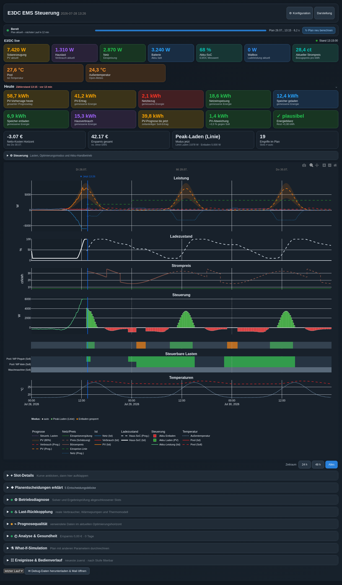

# EMS – Energy Management System

[](https://github.com/RobertHerter/MicroEMS/actions/workflows/ci.yml)

Kostenoptimale Steuerung von Haus-Akku, PV, Fahrzeug und steuerbaren Lasten
(z. B. Pool-Wärmepumpen). Läuft als Python-Dienst auf einem Raspberry Pi
(Raspberry Pi OS **Trixie** / Debian 13), berechnet per **MILP** die optimale
Steuertabelle für 48 h und

- steuert den E3DC-Speicher **direkt per RSCP** (optional, greift real ein) und/oder
- gibt die Sollwerte per **MQTT** an ein beliebiges Smart-Home-System aus
  (z. B. Homey, Home Assistant, ioBroker, Node-RED).

Die Eingangsdaten kommen aus **InfluxDB** (1.x/2.x) **oder** direkt aus den
Originalquellen (E3DC per RSCP, Wetter/Preis/PV aus kostenlosen APIs). **Eine
InfluxDB ist nicht zwingend** – das EMS läuft komplett **standalone** (siehe
„Datenquellen & Standalone"). Wo eine InfluxDB vorhanden ist, bleibt sie
optionaler Fallback je Signal und Ziel für den Writeback der Zukunftswerte.

> Eigennamen wie *Homey*, *Solcast*, *Open-Meteo*, *Energy-Charts* sind nur die
> im Standardfall verwendeten Beispiele. Die MQTT-Ausgabe funktioniert mit jedem
> MQTT-fähigen System; die Datenquellen sind je Signal austauschbar bzw. per
> InfluxDB/REST-Ingest ersetzbar. Fest ist nur der E3DC (RSCP) als Speicher-
> hardware – für andere Geräte müssten Feldnamen/Vorzeichen angepasst werden.

## Funktionsumfang

- **MILP-Optimierung** (PuLP + CBC/HiGHS) über 48 h in 15-min-Slots: Haus-Akku
  (DC/AC-Laden, Entladen), Fahrzeug, steuerbare Lasten – Ziel: minimale
  Netto-Stromkosten inkl. Terminalwert des Akku-Inhalts.
- **Eigene Prognosen** ohne Pflicht-Cloud: Hausverbrauch (Ähnliche-Tage oder ML),
  Strompreis (Spot + Tarifmodell), PV (Solcast **oder** freies pvlib-Modell).
- **PV-Quellen-Autowahl**: pvlib vs. Solcast werden rollierend gegen die realen
  Ertragsdaten bewertet. Fehler bei Preisextremen, am Übergang zwischen
  Netzbezug und PV-Überschuss sowie nahe der Einspeisegrenze zählen stärker;
  die produktive Quelle wird automatisch gewählt und das konditionale
  Unsicherheitsband aus Vorlaufzeit, Saison, Leistungsniveau und
  echten Residuen kalibriert.
- **Direkte E3DC-Steuerung** per RSCP (an echter Hardware verifiziert) mit
  Watchdog, Rücklese-Verifikation und Fail-safe.
- **Steuerbare Lasten**: verschiebbar (Waschmaschine) und thermischer Speicher
  (Pool mit ein/aus-Wärmepumpen), inkl. Temperatur als MILP-Zustand.
- **Robustheit im Echtbetrieb**: Plausibilitäts-Grenzen für externe Eingaben,
  optionale Abend-Reserve, Sofort-Neuberechnung bei großer Live-Abweichung,
  Steuer-Ausfall-Alarm.
- **Beobachtbarkeit**: interaktives HTML-Dashboard, Ersparnis-Tracking gegen eine
  „Ohne-EMS"-Baseline **und** Validierung gegen die echten E3DC-Zähler,
  Invarianten-Prüfung, Drift-Monitor, Erklär-Tooltips.
- **Kalibrierung**: wöchentliche Nachführung von Verbrauchs-, PV- und
  Unsicherheitsparametern als Champion-/Challenger-Vergleich. Neue Werte
  werden auf einem ausgesparten Holdout geprüft und komponentenweise nur bei
  belastbarer Verbesserung übernommen; außerdem wird das Pool-Thermomodell aus
  den gesammelten Messdaten nachgeführt.

## Architektur

```
Datenquellen  ──►  EMS (Pi, Python)                        ──►  MQTT  ──►  Smart-Home
 InfluxDB          1. Verbrauchsprognose (72 h, Ähnliche-Tage/ML)      (Sollwerte, z. B.
  ODER direkt:     2. Eingangsdaten lesen (Preis/PV/SoC/…)  ──►  E3DC   Homey/HA/ioBroker)
  E3DC (RSCP)      3. MILP-Optimierung (48 h) → Steuertabelle  (RSCP-Steuerung, optional)
  Wetter-API       4. Ausgabe: MQTT + optional RSCP          ──►  InfluxDB (Writeback, opt.)
  Preis-API        5. optionaler Writeback in InfluxDB
  PV-Forecast      6. Dashboard (HTML) + JSON-API
```

Warum ein Pi-Dienst und keine App im Smart-Home-System: Die MILP-Optimierung
(192 Slots) und die Historien-Prognose brauchen Python-Bibliotheken und
Rechenleistung, die in einer App-Sandbox nicht sinnvoll verfügbar sind. Das
Zielsystem erhält nur die fertigen Sollwerte per MQTT.

## Module

| Datei | Aufgabe |
|-------|---------|
| `ems/config.py` | YAML-Konfiguration laden/validieren (typisierte Dataclasses) + Overlay |
| `ems/main.py` | Orchestrierung + CLI (`--loop`), HTTP-Server, systemd-Watchdog |
| `ems/optimizer.py` | MILP-Optimierer (PuLP, CBC/HiGHS): Steuertabelle 48 h |
| `ems/forecast.py` | Verbrauchsprognose: Ähnliche-Tage-Mittelung oder ML (HistGradientBoosting) |
| `ems/loads.py` | Steuerbare/verschiebbare Lasten im MILP (deferrable + thermischer Speicher) |
| `ems/rscp.py` | Direkte E3DC-Anbindung (RSCP/pye3dc): Live-Werte, 15-min-Historie, Steuerung |
| `ems/homey_mqtt.py` | MQTT-Client: Sollwerte, Status/Last-Will, Alerts, eingehende Kommandos, Last-Rückmeldungen |
| `ems/influx.py` | InfluxDB 1.x (InfluxQL) / 2.x (Flux): Lesen/Schreiben, 15-min-Resampling |
| `ems/local_history.py` | Lokale SQLite (Hauslast, Ist-Werte, Temperatur, Preis, PV-Prognose, Archive) + Quellen-Weichen |
| `ems/weather.py` | Temperatur + Einstrahlung von Open-Meteo (kein Key) |
| `ems/energycharts.py` + `ems/tariff.py` | Spotpreis (Energy-Charts) + Tarifmodell → Endkunden-Bezugspreis |
| `ems/solcast.py` | PV-Vorhersage von Solcast (mehrere Keys/Resourcen) + Dispatcher der aktiven PV-Quelle |
| `ems/pvforecast.py` | Freie PV-Ertragsprognose mit pvlib + lernendem Open-Meteo-Mehrmodell-Ensemble |
| `ems/pv_ensemble.py` | Horizontabhängige Rolling-Origin-Gewichte und empirische P10/P90-Bänder |
| `ems/pv_eval.py` | pvlib vs. Solcast gegen reale Erträge bewerten, Quelle wählen, p10/p90-Band kalibrieren |
| `ems/sanity.py` | Plausibilitäts-Grenzen für externe Eingaben (Preis/PV/Last) |
| `ems/savings.py` + `ems/savings_validate.py` | Ersparnis-Tracking + Gegenprüfung gegen die echten E3DC-Zähler |
| `ems/validate.py` + `ems/drift.py` | Invarianten-Prüfung eines Plans + Predicted-vs-Actual-Drift |
| `ems/explain.py` | Klartext-Begründung der Steuerentscheidungen (Dashboard-Tooltips) |
| `ems/pool_calibration.py` | Pool-Thermomodell (Verlust/Solar/Heizleistung) aus Messdaten fitten |
| `ems/battery_calibration.py` | Entladewirkungsgrad des Speichers aus Entladephasen messen und nachführen |
| `ems/load_learning.py` | Lastprofil verschiebbarer Lasten aus der Verbrauchsrückmeldung anlernen |
| `ems/archive_thinning.py` | Prognosearchiv ausdünnen: Rohfenster behalten, älteres auf eine Prognose je Zielslot und Vorlaufzeit |
| `ems/planvalue.py` | Entscheidungsgüte: Timing-Note der Ist-Daten + Regret gegen Hellsicht (€/Tag) |
| `ems/archive.py` | Seite `/archiv`: archivierten Optimierer-Lauf wählen und gegen die Ist-Werte legen |
| `ems/gridweather.py` + `ems/priceforecast.py` | Deutschlandweite Wetter-Indizes (Residuallast) + gelernte Börsenpreis-Prognose mit Selbstprüfung |
| `pool_horizon_bench.py` | Misst am echten Schnappschuss, wie weit der binäre Entscheidungshorizont der Thermolasten reichen darf (`binary_horizon_hours`) |
| `ems/ingest.py` | Externe Einspeisung (REST) von Live-/Historienwerten → Betrieb ohne RSCP/InfluxDB |
| `ems/dashboard.py` | Interaktives HTML-Dashboard + JSON-API |
| `tests/` | pytest-Suite (E2E, Optimierer-Randfälle, Prognose, Ersparnis, Diagnose …) |

## Eingangssignale

Hausverbrauch, Strompreis, Haus-Akku-SoC, PV-Erzeugung, PV-Vorhersage, optional
Fahrzeug-SoC und Einspeisevergütung. Strompreis und PV-Vorhersage werden auch für
die Zukunft gelesen. Alle Leistungen in **W**, Preise in **ct/kWh**, Energien in
**Wh**, Rechenraster **15 min**.

Jedes Signal kommt entweder **aus der InfluxDB** (Zuordnung Signal →
Measurement/Field unter `influxdb.signals`) **oder direkt aus der Originalquelle**
(Flags `e3dc_rscp` / `weather` / `tariff` / `solcast` / `pv_model`) **oder per
REST-Ingest**. Ist eine Direktquelle aktiv, wird das entsprechende InfluxDB-Signal
nicht mehr benötigt.

## Datenquellen & Standalone (ohne InfluxDB)

Alle Direktquellen sind unter `config.yaml` einzeln aktivierbar (Default aus,
ändert sonst nichts). Sind alle aktiv, läuft das EMS **komplett ohne InfluxDB**.

**E3DC per RSCP** (`e3dc_rscp`, Bibliothek `pye3dc`):
- `read_live`: aktueller SoC/PV/Last direkt vom Gerät (frischer als der DB-Umweg),
  Fallback auf InfluxDB.
- `control_enabled`: steuert den Speicher direkt (zusätzlich zur MQTT-Ausgabe, die
  parallel weiterläuft). **Greift real ein.** Die `EMS_REQ_SET_POWER`-Modi sind an
  echter Hardware verifiziert (pye3dc 0.10): **0**=auto, **1**=idle, **2**=Entladen,
  **3**=Laden (aus PV), **4**=Netzladen; der Wert ist die Gesamtleistung. `apply_control`
  setzt je Slot Netzladen (Mode 4), Netz-Entladen (Mode 2, nur bei
  `allow_grid_discharge`) oder reine Lade-/Entlade-Grenzen (persistente Limits, kein
  Mode-Eingriff). Mit `verify_control: true` werden die Limits nach dem Schreiben
  zurückgelesen; Abweichungen außerhalb `control_verify_tolerance_w` melden einen
  Steuer-Alarm (`ems/alert`, Dashboard). Aktive Modi werden alle 5 s per Watchdog
  erneuert (der E3DC fällt sonst nach ~10 s auf auto zurück); beim Beenden schaltet
  der Dienst aktiv auf auto zurück (Fail-safe).
- `history_source`: die 15-min-Hauslast kommt aus der lokalen SQLite statt aus der
  InfluxDB. Einmaliger Backfill: `python rscp_import.py --config config.yaml --days
  730` (1 RSCP-Aufruf je Fenster, mehrere Stunden); danach `history_source: true`.
  Zyklisch werden neue Fenster mit Reifeverzug (`history_settle_minutes`) und
  Überlappung (`history_overlap_hours`) nachgeführt.
- **Ist-Werte lokal** (Tabelle `actuals`): jeder Zyklus protokolliert den
  E3DC-Live-Snapshot; Intraday-Korrektur, Ersparnis, Drift und Dashboard-Ist-Kurven
  lesen dann daraus (zentrale Weiche `read_actual_signal`). Zusätzlich integriert
  `live_samples` die 5-s-Werte zeitgewichtet zu belastbaren 15-min-Mitteln; damit
  arbeitet der Last-Nowcast auch während des E3DC-Reifeverzugs.

**Hauslastmodell** (`forecast`): Reale Rückmeldungen steuerbarer thermischer
Verbraucher werden aus der historischen Hauslast entfernt und vom Optimierer nur
mit ihrem neuen Plan wieder ergänzt. Similar-Days und ML werden je Vorlaufzeit
parallel gegen echte, mit Erstellungszeit archivierte Prognosen bewertet. Vor
genügend unabhängigen Tagen bleibt Similar-Days unverändert aktiv; das teure
ML-Schattenmodell trainiert erst nach dem Solver im Hintergrund. Ein zusätzliches
Heiz-/Kühl-Residual wird nur übernommen, wenn es den archivierten Fehler messbar
reduziert.

**Temperatur & Einstrahlung** (`weather`, Open-Meteo, kein Key): stündlicher Abruf
(`past_days`/`forecast_days`) in Tabelle `temperature`/`radiation`, aufs Slot-Raster
interpoliert. Tiefe Historie einmalig via `weather_backfill.py`. Zukunftswerte werden
unveränderlich archiviert (`weather_forecast_archive`) für ehrliche Backtests.

**Bezugspreis** (`tariff`, Energy-Charts, kein Key): Day-Ahead-Spot je Zyklus in
Tabelle `spot_price`; das Tarifmodell rechnet daraus den Endkunden-Bezugspreis:

```
netto  = spot·(1+markup_percent/100) + markup_ct_kwh + levies_ct_kwh + netzentgelt
brutto = netto·(1+vat_percent/100)          # MwSt auf alles
```

Netzentgelt `static`/`included`/`14a` (§14a EnWG zeitvariabel). Tiefe Historie via
`energycharts_backfill.py`. Fehlende Folgetag-Preise ergänzt die Ähnliche-Tage-Schätzung.

**PV-Vorhersage** – zwei austauschbare Quellen (nicht gleichzeitig aktiv):
- `solcast`: rooftop-site-Forecast inkl. P10/P90, mehrere Keys/Resourcen,
  `combine: sum|mean`, Abruf-Budget `calls_per_key_per_day` über das Tageslicht
  verteilt. Tiefe Historie via `solcast_import.py`.
- `pv_model`: **freies pvlib-Modell** (kein Key/Kontingent) aus Paneldaten
  (kWp/Neigung/Azimut je Ausrichtung) + Open-Meteo-Einstrahlung. Das optionale
  Mehrmodell-Ensemble rechnet Best-Match, DWD ICON und ECMWF getrennt, lernt
  Gewichte je Vorlaufzeit ausschließlich aus Rolling-Origin-Archiven und bildet
  P10/P90 aus Modellstreuung plus empirischen Residuen. `shadow: true` rechnet
  es nur zum Vergleich mit, ohne den Optimierer zu beeinflussen.
- **Autowahl** (`pv_source_selection`): sobald beide Quellen genügend gemeinsame
  Archiv-Erfahrung haben, wählt `pv_eval.select_source` die Quelle mit dem
  besseren **Entscheidungsscore** (nur aus echten Rolling-Origin-Archiven, nie
  aus dem optimistischen Cache). Gemeinsame Slotgewichte priorisieren
  Preisextreme, Netz/PV-Kipppunkte und Einspeiserisiken; fehlt ausreichend
  Hauslast-Kontext, bleibt automatisch die normale Energie-WAPE maßgeblich.
  Auswahl, Score, WAPE und Begründung werden persistiert. `python
  pv_source_report.py` zeigt den Vergleich manuell und empfiehlt das kalibrierte
  p10/p90-Band.

Beide PV- und alle übrigen Signale sind auch per **REST-Ingest** einspielbar
(`ingest`): so kann ein Fremdsystem die Daten liefern, RSCP/InfluxDB entfallen.
Payloads siehe `config.example.yaml`.

## Installation

> **Schritt-für-Schritt-Anleitungen** (von 0 aufsetzen, nur mit einem E3DC, ohne
> InfluxDB oder andere Abhängigkeiten):
> * [docs/howto-standalone.md](docs/howto-standalone.md) – als systemd-Dienst
> * [docs/howto-docker.md](docs/howto-docker.md) – mit Docker Compose
>
> Der folgende Abschnitt beschreibt die Bestandteile im Detail.


```bash
sudo apt update
sudo apt install -y python3 python3-venv python3-pip coinor-cbc mosquitto mosquitto-clients

sudo mkdir -p /opt/ems && sudo chown "$USER" /opt/ems
# Projektdateien nach /opt/ems kopieren (ems/, requirements.txt, config.example.yaml, *.service ...)
cd /opt/ems
python3 -m venv .venv
. .venv/bin/activate
pip install -r requirements.txt        # bzw. requirements.lock (exakt getestete Versionen)
# nur für Entwicklung und Tests:
# pip install -r requirements-dev.txt

cp config.example.yaml config.yaml     # anpassen – siehe „Konfiguration"

# Einmaliger Testlauf:
python -m ems.main --config config.yaml --log-level INFO
```

> PuLP bringt einen CBC-Solver mit; das System-Paket `coinor-cbc` ist optional als
> robuste Alternative. Für `optimization.solver: highs` zusätzlich `highspy`.

### Als Dienst (systemd)

```bash
sudo useradd -r -s /usr/sbin/nologin ems 2>/dev/null || true
sudo chown -R ems:ems /opt/ems
sudo cp ems.service \
        ems-kalibrierung.service ems-kalibrierung.timer \
        ems-savings.service ems-savings.timer \
        ems-backup.service ems-backup.timer /etc/systemd/system/
sudo systemctl daemon-reload
sudo systemctl enable --now ems.service \
        ems-kalibrierung.timer ems-savings.timer ems-backup.timer
journalctl -u ems -f
```

Der Dienst rechnet im Intervall `general.run_interval_minutes` (Standard 15 min)
neu, läuft gehärtet als Benutzer `ems` (Port 80 über `CAP_NET_BIND_SERVICE`,
Schreibzugriff nur auf `/opt/ems`) und mit **systemd-Watchdog** (Neustart, wenn das
Lebenszeichen ausbleibt). Die Timer:

- **`ems-kalibrierung.timer`** (So 03:00): vier Schritte nacheinander –
  Verbrauchs-/PV-Kalibrierung (`kalibrierung.py`) inkl. Champion-/Challenger-
  Prüfung und pvlib-p10/p90-Bandkalibrierung, Pool-Thermomodell
  (`ems.pool_calibration --apply`), Entladewirkungsgrad
  (`ems.battery_calibration --apply`), Lastprofile
  (`ems.load_learning --apply`) und das Ausdünnen des Prognosearchivs
  (`ems.archive_thinning --apply`).
  PV-Korrektur, Lastkorrektur und PV-Band werden getrennt auf einem ausgesparten
  Holdout bewertet; nur belastbar bessere Challenger werden übernommen.
  Alles Übernommene landet im Overlay `config_overrides.yaml` und greift
  spätestens im nächsten EMS-Zyklus ohne Dienstneustart. Eine schreibfreie
  Vorschau liefert `python kalibrierung.py --config config.yaml --dry-run`.
  Was jeder Schritt misst und wann er etwas übernimmt:
  [docs/kalibrierung.md](docs/kalibrierung.md).
- **`ems-savings.timer`** (täglich 02:45): validiert die Vortags-Ersparnis gegen
  die echten E3DC-Zähler (`savings_check.py --persist`).
- **`ems-backup.timer`** (wöchentlich): sichert die unversionierten Dateien
  (`config.yaml` mit Zugangsdaten, Kalibrierprofile, Ersparnis-Status) via
  [backup.sh](backup.sh). **Für echte Sicherheit ein externes Ziel setzen**
  (`Environment=EMS_BACKUP_DIR=/mnt/nas/ems-backup` in `ems-backup.service`).

### Alternativ: Docker (optional)

Komplette Anleitung: [docs/howto-docker.md](docs/howto-docker.md).

MicroEMS lässt sich statt als systemd-Dienst vollständig mit Docker Compose
betreiben. Das fertige Multi-Arch-Image unterstützt `linux/amd64` und
`linux/arm64` (Raspberry Pi):

```bash
ghcr.io/robertherter/microems:3.11.1
```

Voraussetzung sind Docker Engine mit Compose-Plugin sowie Netzwerkzugriff des
Containers auf E3/DC, MQTT, InfluxDB und die verwendeten Internetdienste. Bei
Diensten auf demselben Host in der Config nicht `localhost`, sondern die
Host-IP oder ein gemeinsames Docker-Netz verwenden.

#### 1. Verzeichnisse und Konfiguration vorbereiten

```bash
mkdir -p ~/microems/config ~/microems/data
cd ~/microems
curl -fsSL \
  https://raw.githubusercontent.com/RobertHerter/MicroEMS/v3.11.1/config.example.yaml \
  -o config/config.yaml
chmod 600 config/config.yaml
```

In `config/config.yaml` die Anlagenwerte, Zugangsdaten und IP-Adressen setzen.
Zusätzlich die folgenden vorhandenen Einträge auf die gemounteten
Containerpfade ändern:

```yaml
e3dc_rscp:
  history_db_path: /app/data/e3dc_history.sqlite

dashboard:
  enabled: true
  serve: true
  host: 0.0.0.0
  port: 8080
  output_path: /app/data/dashboard.html

report:
  snapshot_path: /app/data/last_run_debug.json

calibration:
  pv_profile: /app/data/kalibrierung_profil.yaml

savings:
  state_path: /app/data/savings_state.json
```

`config` enthält anschließend auch das automatisch erzeugte
`config_overrides.yaml`. Historie, Dashboard, Kalibrierprofile und
Ersparnisstatus liegen dauerhaft unter `data`; ein Container-Update löscht
diese Dateien nicht.

#### 2. Compose-Datei für das fertige Image anlegen

Als `compose.yaml` speichern:

```yaml
name: microems

x-microems: &microems
  image: ghcr.io/robertherter/microems:${MICROEMS_TAG:-3.11.1}
  restart: unless-stopped
  environment:
    TZ: Europe/Berlin
  volumes:
    - ./config:/app/config
    - ./data:/app/data

services:
  ems:
    <<: *microems
    container_name: microems
    ports:
      - "${EMS_PORT:-8080}:8080"

  scheduler:
    <<: *microems
    container_name: microems-scheduler
    depends_on:
      - ems
    entrypoint: ["cron", "-f"]
    healthcheck:
      disable: true
```

Der Tag ist bewusst auf eine feste Version gesetzt. Alternativ kann in einer
Datei `.env` beispielsweise `MICROEMS_TAG=1.4` oder für stets den neuesten
Build `MICROEMS_TAG=latest` hinterlegt werden.

#### 3. Konfiguration prüfen und EMS starten

```bash
docker compose pull
docker compose run --rm ems --config /app/config/config.yaml --check
docker compose up -d
docker compose ps
```

`--check` validiert die Konfiguration und löst einen Optimierungstest, ohne
Steuerwerte zu senden. Nach dem Start ist das Dashboard unter
`http://<Docker-Host>:8080` erreichbar. Der Healthcheck benötigt beim ersten
Start bis zu 90 Sekunden.

```bash
docker compose logs -f ems
docker compose logs -f scheduler
curl -fsS http://localhost:8080/version
```

Der Container `ems` führt den regulären 15-Minuten-Loop aus. `scheduler`
ersetzt die systemd-Timer und startet über [docker/crontab](docker/crontab):

- täglich um 02:45 Uhr die Ersparnis-Validierung,
- sonntags um 03:00 Uhr die Verbrauchs-, PV- und Pool-Kalibrierung.

#### 4. Von systemd auf Docker umsteigen

**Niemals systemd- und Docker-EMS gleichzeitig mit aktivierter
E3/DC-Steuerung betreiben.** Beide Instanzen würden sonst konkurrierende
Lade-/Entladelimits senden. Vor dem produktiven Docker-Start die lokale Instanz
und ihre Timer stoppen:

```bash
sudo systemctl disable --now ems.service
sudo systemctl disable --now ems-kalibrierung.timer ems-savings.timer ems-backup.timer
docker compose up -d
```

Für einen gefahrlosen Paralleltest zuerst `e3dc_rscp.control_enabled: false`
und `dashboard.controls_enabled: false` verwenden.

#### 5. Aktualisieren, stoppen und sichern

Für ein Update den gewünschten Tag in `.env` ändern und anschließend:

```bash
docker compose pull
docker compose up -d
docker image prune
```

Stoppen und wieder starten:

```bash
docker compose stop
docker compose start
```

`docker compose down` entfernt nur Container und Netzwerk, nicht die
Bind-Mount-Daten in `config` und `data`. Beide Verzeichnisse regelmäßig auf ein
externes Ziel sichern.

#### Image lokal selbst bauen

Das Repository enthält weiterhin eine Build-Variante in
[docker-compose.yml](docker-compose.yml):

```bash
git clone https://github.com/RobertHerter/MicroEMS.git
cd MicroEMS
mkdir -p config data
cp config.example.yaml config/config.yaml
docker compose up -d --build
```

Das Image ([Dockerfile](Dockerfile)) basiert auf `python:3.13-slim`, enthält
HiGHS sowie CBC als Solver-Fallback und startet
`python -m ems.main --config /app/config/config.yaml --loop`.

## Konfiguration

Zentrale Datei `config.yaml` (aus `config.example.yaml` kopieren – dort ist jeder
Block kommentiert). `config.yaml` enthält **Zugangsdaten** (InfluxDB, MQTT, E3DC,
API-Keys) und ist deshalb **nicht** im Git; sie wird vom Backup-Timer gesichert.

Interaktive Änderungen (Dashboard-Steuerpanel) und die Kalibrierung schreiben in
eine **Overlay-Datei `config_overrides.yaml`**, die beim Laden über `config.yaml`
gelegt wird – so überdauern sie einen Neustart, ohne die kommentierte Basisdatei
anzutasten. `config_overrides.yaml`, `kalibrierung.yaml` und
`kalibrierung_profil.yaml` sind anlagenspezifische Laufzeitdateien: Sie bleiben
lokal, werden nicht versioniert und vom Backup-Timer gesichert.

Wichtige Blöcke:

| Block | Inhalt |
|-------|--------|
| `general` | Zeitzone, Standort, Feiertagsregion, Horizont, Slot-Länge und Rechenintervall |
| `house_battery` / `inverter` | Kapazität, Lade-/Entladeleistungen, Wirkungsgrade, SoC-Grenzen, WR-/Netzanschlussgrenzen |
| `vehicle` | Auto-Akku, Lade-Min/-Max, Ziel-SoC, Abfahrtzeit(en), Ladekurve |
| `optimization` | Solver, MIP-Gap, Strafterme, Ladestrategie (`auto/peak/asap/late`), **Abend-Reserve** |
| `feed_in` / `tariff` | Einspeisevergütung; bei `zero_at_negative_price` wird in Negativpreis-Slots Laden/Abregeln statt Einspeisen priorisiert; Bezugspreis-Tarifmodell |
| `weather` / `solcast` / `pv_model` / `pv_source_selection` | Wetter- und PV-Quellen + Autowahl |
| `e3dc_rscp` | RSCP-Zugang, `read_live`/`control_enabled`/`history_source`, Verifikation |
| `controllable_loads` | verschiebbare + thermische Lasten (Pool-WP) |
| `sanity` | Plausibilitäts-Grenzen (Preis-Spike, PV-Cap, negative Werte) |
| `recalc` | Sofort-Neuberechnung bei großer Live-Abweichung vom Plan |
| `monitoring` | Drift-, Solver- und Ausführungs-Audit, Alarm-Schwellen |
| `mqtt` / `dashboard` / `influxdb` | Ausgabe/Anbindung: Broker, Web/API, DB |
| `savings` / `calibration` / `report` | Ersparnis-Status, Kalibrierprofile, Debug-Report |

### Anlagenwerte & Steuergrößen

Konfigurierbar sind u. a. Kapazitäten, Leistungsgrenzen, Wirkungsgrade und SoC-
Grenzen von Haus- und Auto-Akku sowie Einspeisevergütung (fest oder aus DB).
Der Optimierer bestimmt je 15-min-Slot: Haus-Akku **DC-Laden** (nur PV), **AC-Laden**
(Netz), **Entladen** und **Auto-Ladeleistung** (0 oder Min…Max). Nebenbedingungen:
SoC-/Leistungsgrenzen, WR-Durchsatz, kein gleichzeitiges Laden/Entladen, Auto-Ziel-SoC
zur Abfahrt. Ziel: minimale Netto-Stromkosten inkl. Terminalwert des Akku-Inhalts.

### Abend-Reserve (optional)

`optimization.evening_reserve_*` hält den Akku (weiche Nebenbedingung, nie
infeasible) über einem Mindest-SoC, damit er nicht vor der teuren Abendspitze
leerläuft. Fest (`evening_reserve_soc_percent` + Fenster) oder **adaptiv**
(`evening_reserve_auto`): Höhe = Energie für die Restlast während der abendlichen
Preisspitze, Fenster von `hold_from_hour` bis zum Peak-Beginn.

### Steuerbare / verschiebbare Lasten (`controllable_loads`)

Optionale Liste zusätzlicher Lasten, die der Optimierer mitplant und in die
günstigsten/PV-reichsten Slots legt. Zwei Typen (`ems/loads.py`):

- **`deferrable`** – muss `runtime_minutes` im Fenster laufen; Leistung konstant
  (`power_w`) oder als 15-min-Kurve (`power_profile_w`). Über `power_topic`
  (optional zusätzlich `feedback_topic`) wird die reale Ausführung archiviert
  und im Dashboard als eigene Soll-/Ist-Zeile und Leistungskurve geprüft;
  `feedback_on_threshold_w` trennt Standby von einem echten Lauf.
- **`thermal`** – thermischer Speicher (Pool): Temperatur ist ein **MILP-Zustand**
  im Band `[min_c, max_c]`, geheizt über `stages` (ein/aus-Wärmepumpen, per
  `requires` koppelbar); Verlust `~ loss_w_per_k·(T−T_außen)`, optionaler solarer
  Eintrag, Ist-Temperatur aus `temp_signal`. Je Stufe geht der Schaltbefehl an
  `control_topic`; optionale Rückmeldung über `feedback_topic` (an/aus) bzw.
  `power_topic` (gemessene Leistung). Bei eigenem WP-Thermostat (`thermostat: true`)
  ist das Signal eine Heiz-**Freigabe**. Das Pool-Thermomodell wird wöchentlich aus
  den Messdaten kalibriert (`pool_calibration.py`).

Leere Liste (Default) = keine zusätzlichen Variablen.

## Anbindung an ein Smart-Home-System (MQTT)

Das EMS publiziert bei jedem Zyklus die Sollwerte des laufenden Slots. Ein
beliebiger MQTT-Client (Homey, Home Assistant, ioBroker, Node-RED …) abonniert die
Topics und schreibt die Werte auf die Geräte-Capabilities.

```
ems/setpoint/batt_charge_limit_w      Ladelimit (Hardware-Max = frei laufen)
ems/setpoint/batt_discharge_limit_w   Entladelimit (Hardware-Max = frei laufen)
ems/setpoint/batt_grid_charge_w       Netzladen erzwingen (Akku <- Netz)
ems/setpoint/batt_grid_discharge_w    Netz-Entladen (Akku -> Netz)
ems/setpoint/charge_limited           true/false
ems/setpoint/discharge_limited        true/false
ems/setpoint/car_charge_w             z. B. 4000
ems/setpoint/mode                     "auto" | "grid_charge" | "hold" | ...
ems/setpoint/updated                  ISO-Zeitstempel des Slots
ems/loads/<name>                      Sollzustand steuerbarer Lasten (0/1, retained)
ems/schedule                          komplette 48-h-Tabelle als JSON (retained)
ems/status                            "online" | "offline" (retained, Last Will)
ems/alert                             Störungen als JSON {level, message, time}
```

Eingehende Kommandos (an das EMS):

```
ems/cmd/recalc              sofortige Neuberechnung (Payload egal)
ems/cmd/car_boost           "1"/"0": Auto sofort mit Max-Leistung laden bis Ziel-SoC
ems/cmd/car_departure_time  "HH:MM" | "default" | "off"/"urlaub" (kein Ziel-SoC erzwingen)
ems/cmd/car_target_soc      Ziel-SoC in % (1..100) | "default"
ems/cmd/min_soc             Haus-Akku Minimum-SoC in % | "default"
ems/cmd/max_soc             Haus-Akku Maximum-SoC in % | "default"
ems/cmd/load/<name>         steuerbare Last aktivieren/deaktivieren | "default"
```

Parameter-Kommandos **mit Retain** publizieren, dann überstehen sie einen
EMS-Neustart. Die wirksamen Werte meldet das EMS unter `ems/vehicle/*` und
`ems/battery/*` zurück.

**Fail-safe:** Sollwerte werden **ohne** Retain publiziert – fällt das EMS aus, hält
der Broker keine veralteten Steuerbefehle vor. Zusätzlich hält der Loop eine
stehende Verbindung mit **Last Will**: stirbt der Prozess, setzt der Broker selbst
`ems/status = offline`. Empfohlener Watchdog: wenn `ems/status` auf `offline`
wechselt (oder `ems/setpoint/updated` ~35 min ausbleibt), alle Limits auf
Hardware-Maximum setzen (Eigenverbrauchs-Automatik des E3DC).

## Dashboard



Nach jedem Lauf entsteht `dashboard.html` (im Loop-Betrieb per HTTP auf Port 80,
Auto-Reload nach jeder Neuberechnung):

Die dafür benötigte `plotly.min.js` wird beim ersten Dashboard-Lauf automatisch
aus dem installierten Plotly-Paket erzeugt. Das große, generierte Browser-Bundle
wird deshalb nicht im Git-Repository gespeichert.

- **KPI-Kacheln**: Netto-Kosten Horizont, Ersparnis gesamt (inkl. an den Zählern
  bestätigter Ersparnis), Modus jetzt (mit Limits), Eingriffe im Plan; die
  Planprüfung erscheint als eigenes Banner darüber.
- **E3/DC-Livekacheln** (Default 5 s): Solarerzeugung, Hauslast, Netzfluss,
  Batterieleistung, Akku-SoC, Wallbox – dazu, wenn vorhanden, die Pool-Ist-
  Temperatur und die Außentemperatur. Ein zweiter Bereich zeigt PV-Tagesprognose,
  aktuellen Bezugspreis sowie die E3/DC-Zählerstände des Tages für PV, Haus,
  Netzbezug/-einspeisung und Speicherladung/-entladung. PV-Soll bis zur aktuellen
  Uhrzeit, Ist-Abweichung, Zähleralter und Energiebilanz machen unvollständige oder
  veraltete Tagesdaten sichtbar. Momentanwerte werden 5 s, die summierten
  Tageszähler ressourcenschonend einmal pro Minute aktualisiert; auf dem Handy ist
  der Tagesbereich standardmäßig eingeklappt.
- **Leistung** (PV mit p10–p90-Band, Verbrauch, Netz, Einspeise-Linie; Ist
  durchgezogen, Prognose gestrichelt), **Ladezustand**, **Strompreis** +
  Einspeisevergütung, **Steuerung**, **Modus-Zeitleiste** (Farbstreifen + Hover-
  Klartext), **Steuerbare Lasten** und **Temperaturen** (erwartet vs. echt).
- Farbcodierte, einklappbare Diagnose-Panels (Betriebsdiagnose,
  Pool-Rückkopplung) – Status auch eingeklappt sichtbar.
- **Prognosen & Qualität**: Ein gemeinsames Panel bündelt aktuellen Datenstatus,
  7-/30-Tage-WAPE und Bias sowie einen Tagesvergleich von PV-Ist, Solcast,
  pvlib und dem produktiven Last-Soll. Fehler-Heatmaps zeigen PV und Hauslast
  nach lokaler Zielstunde und Vorlaufzeit (0–6/6–24/24–48 h); auswählbare
  Prognose-Vintages legen bis zu sechs archivierte Erstellungsstände eines
  Zieltags gegen den tatsächlichen Ist-Verlauf. Reifekarten zeigen für PV-Korrektur,
  P10/P90-Band, Lastkorrektur und Quellenwahl die Stichprobe, zeitliche Abdeckung,
  aktiven beziehungsweise empfohlenen Wert und eine transparent hergeleitete
  Datenkonfidenz. Wöchentliche Kalibrierungsstände werden mit Erstellungszeit
  archiviert; Faktoren, Bandparameter und deren Änderungen erscheinen als
  Verlauf. Die Ansicht ist mobil- und Dark-Mode-tauglich.
- **Interaktives Steuerpanel** (`dashboard.controls_enabled: true`): Lasten an/aus +
  Kernparameter, Optimierungsmodus, manuelles Akku-Laden/-Entladen – ohne MQTT.
  Die automatische direkte E3/DC-Steuerung lässt sich dort ebenfalls sicher
  schalten; beim Ausschalten werden aktive RSCP-Modi und SmartPower-Limits sofort
  freigegeben und am Gerät zurückgelesen. Direkte RSCP-Steuerung und die davon
  unabhängigen MQTT-Sollwerte sind im Panel klar getrennt, während das reine
  Live-Monitoring weiterläuft.
- **Konfigurationseditor**: Ein Zahnrad in der Kopfzeile öffnet eine responsive,
  nach Bereichen gruppierte Seite für alle Werte aus `config.yaml`. Hilfetexte
  stammen aus `config.example.yaml`; steuerbare Lasten lassen sich dort anlegen
  und entfernen. Vor dem Speichern wird die vollständige Konfiguration geprüft,
  gesichert und der EMS-Dienst geordnet neu gestartet.
- **Grafischer Planvergleich**: Akku-, Netz- und SoC-Verlauf des aktiven Plans
  gegen eine Vorschau mit anderem Optimierungsmodus, bevor dieser übernommen wird.
- **Manuelle Akku-Zeitplanung**: Netzladen/Entladen auf einem 48-h-Zeitstrahl planen
  (persistent, auch ohne offenen Browser ausgeführt, abbrechbar; SoC-/Leistungs-
  grenzen geprüft).

Die Beispielausgabe (**synthetische Daten**) liegt als
[dashboard_beispiel.html](dashboard_beispiel.html) bei – regenerierbar mit
`python beispiel_dashboard.py`. Sie enthält Beispielwerte für die Live- und
Tageskacheln: da eine eigenständige Datei keinen Server hat, ersetzt das Skript
`fetch` durch eine Attrappe mit synthetischer Antwort – die Panels rendern also
über ihren echten Code-Pfad. Screenshot erneuern (Dunkelmodus; die ausgelieferte
HTML bleibt themenneutral und folgt der Einstellung des Betrachters):

```bash
python beispiel_dashboard.py
# Dunkelmodus nur für das Bild erzwingen (temporäre Kopie)
sed "s/var dark=saved==='dark'||(!saved&&matchMedia('(prefers-color-scheme:dark)').matches);/var dark=true;/" \
  dashboard_beispiel.html > /tmp/dash_dark.html
chromium --headless --no-sandbox --hide-scrollbars --window-size=1500,2560 \
  --virtual-time-budget=6000 --screenshot=dashboard_beispiel.png /tmp/dash_dark.html
```

### Webserver & API (Basic Auth)

Der HTTP-Server liefert das Dashboard und JSON-Endpunkte: `/api/data.json`
(vollständiger Optimierungs-Zustand, ideal für Grafana/Node-RED), `/api/live.json`
(aktueller E3/DC-Snapshot, Intervall `dashboard.live_refresh_seconds`, `0` = aus).
Die gesamte Weboberfläche lässt sich mit **Basic Auth** absichern
(`dashboard.username`/`password`; leer = ungeschützt).

### Konfiguration im Browser bearbeiten

Der Editor ist bewusst nur verfügbar, wenn alle drei Schutzbedingungen erfüllt
sind:

```yaml
dashboard:
  controls_enabled: true
  config_editor_enabled: true
  username: "ems-admin"
  password: "ein-langes-eigenes-passwort"
```

Danach erscheint im Dashboard oben der Button **Konfiguration**. **Prüfen**
validiert den aktuellen Entwurf ohne Änderung. **Speichern & EMS neu starten**
schreibt die Datei atomar, legt vorher eine Kopie unter `backup/config/` ab und
startet den Prozess geordnet neu (systemd: `Restart=on-failure`; Docker Compose:
`restart: unless-stopped`). Gleichzeitig werden vorhandene
`config_overrides.yaml`-Werte in den sichtbaren Stand eingearbeitet und beim
Speichern konsolidiert, damit kein unsichtbares Overlay die neue Auswahl wieder
überschreibt.

Da `config.yaml` Zugangsdaten enthält und der eingebaute Server kein TLS
terminiert, sollte der Editor nur im vertrauenswürdigen LAN oder hinter einem
HTTPS-Reverse-Proxy erreichbar sein.

## Ersparnis-Tracking & Validierung

Für jeden abgeschlossenen Slot vergleicht das EMS die **tatsächlichen** Netzkosten
(gemessener Netzbezug/-einspeisung × Preis) mit einer Simulation, was der E3DC
**ohne EMS** getan hätte (`savings.py`, Zustand in `savings_state.json`,
Measurement `ems_savings`). Zusätzlich prüft `savings_check.py` (täglich per Timer)
die Vortags-Ersparnis **unabhängig gegen die echten E3DC-Energiezähler**: es liest
die gemessenen 15-min-Energieaggregate, rechnet Ist vs. „Ohne-EMS"-Baseline und
deckt über die Energiebilanz Vorzeichen-/Integrationsfehler auf. Die kumulierte,
zähler-bestätigte Ersparnis erscheint im Dashboard.

```bash
python savings_check.py --config config.yaml --days 7    # Fenster-Report
python savings_check.py --config config.yaml --summary   # kumuliert (nur DB)
```

## Diagnose & Modell-Prüfung

- **`ems/validate.py`** – prüft jeden Plan gegen Invarianten (SoC-/Leistungsgrenzen,
  Energiebilanz, kein gleichzeitiges Laden/Entladen, DC-Laden nur aus PV,
  Einspeisebegrenzung, Ausführbarkeit) plus ökonomische Plausibilität (nie teurer
  als die Baseline). Läuft in Tests, im Backtest und live (Banner + `ems/alert`).
- **`ems/drift.py`** – zwei Prüfungen mit unterschiedlicher Reichweite:
  1. *SoC-Kurve* – Predicted-vs-Actual-MAE (Measurement `ems_drift`), Warnung
     über der Schwelle. Findet akute Ausreißer.
  2. *Energiebilanz* – wie viel SoC eine ans Haus gelieferte kWh real kostet,
     gegen `discharge_efficiency`. **Nötig, weil die Kurve allein systematische
     Modellfehler nicht findet:** jeder Zyklus rechnet neu ab dem gemessenen
     SoC, der Fehler summiert sich dort nie auf. Ein Entladewirkungsgrad von
     0,93 statt real 0,79 erzeugte 0,7 pp MAE – und lag über eine Nacht um
     zweistellige Prozentpunkte daneben. Die Bilanzprüfung meldet denselben Fall
     mit −16 % und schlägt binnen ein, zwei Tagen an (`efficiency_window_days`,
     `efficiency_alert_percent`; stündlich, reine SQLite-Reads).
  3. *Ausführungs-Versatz* – summiert die vorzeichenbehaftete Soll-Ist-Abweichung
     des Ausführungs-Audits über ein Fenster. Der Audit selbst prüft je Slot; ein
     Versatz von wenigen Watt bleibt dort unter jeder Schwelle und ist über eine
     Woche trotzdem kWh. Alarmiert wird auf dem **Median**, nicht dem Mittelwert:
     die Verteilung hat einen schweren Rand (einzelne Slots >800 W), der
     Mittelwert meldete −67 W, während die Anlage typischerweise auf −12 W genau
     folgt. Nur zählerbasierte Prüfungen zählen – die Live-Variante mittelt ~1 min
     und streut gegen einen 15-min-Sollwert um ±1 kW.
  4. *Lastprognose-Versatz* – die Prognose, die **vor Tagesbeginn** galt, gegen
     die gemessene Hauslast. Das **Nachtfenster wird eigens bewertet**: ein
     Sockelfehler aus der Grundlast-Zerlegung trifft oft nur die Nacht und
     verschwindet im Tagesmedian – gemessen +359 W nachts bei nur +62 W über den
     ganzen Tag. Ohne die Fenstertrennung wäre genau der Fehler durchgerutscht,
     der den Akku nachts leerlaufen ließ (`load_bias_window_days`,
     `load_bias_alert_w`).
- **`ems/battery_calibration.py`** – misst den **Entladewirkungsgrad** aus den
  Ist-Werten und führt ihn wöchentlich nach. Gemessen wird über
  *zusammenhängende Entladephasen*, nicht je Slot: der SoC kommt nur in ganzen
  Prozent (~223 Wh), eine Slot-weise Auswertung greift genau die Slots heraus,
  in denen der Zähler umspringt, und liefert Werte bis über 1,0. Auf dieser
  Anlage ergab die Messung **0,79 statt der angesetzten 0,93** – 10 kWh ans Haus
  kosten damit 57 % SoC statt 48 %, über eine Nacht zweistellige Prozentpunkte
  Prognosefehler. Grund ist der Teillastbetrieb: nachts entlädt der Speicher mit
  0,8–1,4 kW, also 6–12 % der WR-Nennleistung. Übernahme gedämpft ins Overlay,
  mit Plausibilitätsgrenzen; die Ladeseite wird bewusst nicht gefittet
  (Ladephasen enden meist bei 100 % und sind zu kurz für die SoC-Auflösung).

  ```bash
  python -m ems.battery_calibration --config config.yaml --days 30
  python -m ems.battery_calibration --config config.yaml --days 30 --apply
  ```
- **`ems/load_learning.py`** – lernt das **Lastprofil** einer verschiebbaren Last
  (Waschmaschine, Spülmaschine) aus der Verbrauchsrückmeldung, statt sie mit
  konstanter Leistung zu planen. Der Optimierer kann das längst fahren
  (`power_profile_w` = Leistung je Slot ab dem Startslot) – eingetragen werden
  musste es bisher von Hand. Läufe werden über einer Einschaltschwelle erkannt,
  kurze Einbrüche (Pause vor dem Schleudern) überbrückt; je Slotposition zählt
  der **Median** über die Läufe, damit ein Fehlstart das Profil nicht verzieht.
  Übernahme ins Overlay erst ab drei Läufen und nur in plausiblen Grenzen für
  Dauer und Energie. Voraussetzung: `power_topic` für die Last konfiguriert.

  ```bash
  python -m ems.load_learning --config config.yaml --days 30
  python -m ems.load_learning --config config.yaml --days 30 --apply
  ```

  Im Dashboard zeigt das Panel **Gelernte Lastprofile** unter der Steuerung, was
  bisher erkannt wurde (Läufe, Dauer, Energie, Spitze, Profil als Balken) und ob
  es schon in der Planung steckt – Endpoint `/api/load-profiles.json`, lädt erst
  beim Aufklappen. Zu bedienen gibt es nichts: das Anlernen läuft passiv aus der
  Rückmeldung mit.
- **Sanity-Grenzen** (`sanity`) – begrenzen Preis-Spikes, negative/überhöhte PV und
  negative Last vor dem Solve; ein einzelner API-Ausreißer verzerrt keinen Zyklus.
- **Ausführungs-Audit + Auto-Recalc** – vergleicht Soll/Ist des laufenden Slots
  (Akku/SoC; Netz nur informativ, da Bilanz-Residuum) und rechnet bei großer
  Live-Abweichung (`recalc`) sofort neu.
- **Debug-Report-Button** (`report.enabled: true`) – lädt den Schnappschuss des
  letzten Laufs (ohne Zugangsdaten) für die Offline-Analyse.
- **`backtest.py`** – spielt vergangene Tage durch den Optimierer und prüft jeden
  Plan; findet Modellfehler über Monate echter Daten in Minuten:

  ```bash
  python backtest.py --config config.yaml --days 120
  python backtest.py --config config.yaml --start 2026-01-01 --end 2026-03-01
  python backtest.py --config config.yaml --days 30 --historical-forecasts
  ```

  Mit `--historical-forecasts` wird ausschließlich der jeweils produktiv
  archivierte Prognosestand verwendet (kein nachträglich bekannter Ist-Verlauf).
  Schreibt nichts in die DB; als Regressions-Sweep nach jeder Modelländerung
  laufen lassen (erwartet: 0 Fehler, 0 negative Ersparnis-Tage).

## Lauf-Archiv: alten Plan gegen die eingetretenen Werte legen

Das Dashboard zeigt Plan **und** Ist nur für den *aktuellen* Lauf. Die eigene
Seite **`/archiv`** (Kopfzeilen-Link 🕘 *Lauf-Archiv*) macht das für jeden
archivierten Lauf: Lauf aus der Liste wählen (oder mit ◀ älter / neuer ▶
durchblättern), die Kurven werden mit den seither gemessenen Ist-Werten
überlagert. Grundlage sind die Debug-Schnappschüsse, die jeder Zyklus ohnehin
ablegt (`debug_snapshot`, rollierend die letzten 1000 Läufe ≈ 10 Tage) – dort
stehen die Eingaben (PV-/Last-Prognose, Preis, Start-SoC) *und* der
beschlossene Plan.

- Durchgezogen = Plan dieses Laufs, gestrichelt = Ist. Ist-Werte gibt es nur für
  die seit dem Lauf vergangene Zeit; bei einem frischen Lauf also nur am linken
  Rand (die Kachel *Ist-Abdeckung* zeigt, wie viel).
- Kennzahlen je Lauf: Solver-Status (inkl. Grund bei `Infeasible`), Plankosten,
  und die Abweichung Plan↔Ist als MAE für PV, Last, Akku, SoC und Preis.
- **Preis**: durchgezogen der tatsächliche *Börsenpreis*. Wo er zur Planung
  schon veröffentlicht war, ist das der Planpreis selbst – dort genügt eine
  Linie. Wo der Plan schätzen musste (Folgetag vor ~13:00, zusätzlich
  gedämpft), zeigt die durchgezogene Linie den inzwischen bekannten Preis und
  gestrichelt *Preis (Schätzung)* die Annahme des Laufs; der Abstand **ist** der
  Schätzfehler. Die Kachel nennt ihn separat für den geschätzten Teil – dort
  steckt die eigentliche Preisunsicherheit (gemessen 5,1 ct/kWh MAE in 96 von
  192 Slots eines 00:00-Laufs).
  Im **Dashboard** ist der Vergleich anders gelagert: dort sind die geschätzten
  Slots zwangsläufig genau die *ohne* Börsenpreis – ein „Ist" dazu gibt es im
  selben Lauf nie. Das Preis-Panel zeigt deshalb *Börsenpreis*, *Preis
  (Schätzung)* für den noch unveröffentlichten Rest und zusätzlich *Preis
  (Schätzung 00:00)*: was der Morgenplan für die inzwischen veröffentlichten
  Slots angenommen hatte. Der Abstand zur durchgezogenen Linie **ist** der
  Schätzfehler (live gemessen 5,1 ct/kWh).
- Vorzeichen wie in den Ist-Signalen: Akku positiv = laden, Netz positiv = Bezug.
- Vorausgewählt ist der Lauf von **heute 00:00** – der Tagesplan, an dem sich
  die Prognosegüte des Morgens zeigt (der aktuellste Lauf steht ja im
  Dashboard). Über das Datumsfeld wird der Tag gewechselt, die Liste zeigt dann
  nur dessen Läufe; ◀ älter / neuer ▶ blättert auch über Tagesgrenzen.
- Der ausgewählte Lauf steht in der URL (`/archiv?ts=…`) – so ist eine
  konkrete Ansicht verlinkbar, z. B. für eine Fehlermeldung.

Damit ist die Frage „was hat der Optimierer damals eigentlich erwartet?"
nachträglich beantwortbar – etwa bei einem infeasiblen Plan oder einer
unerwarteten Akku-Entladung. Endpoints: `/api/archive-runs.json` (Liste),
`/api/archive-run.json?ts=<generated>` (ein Lauf mit Plan, Ist und Abweichung).

## Börsenpreis-Prognose aus deutschlandweitem Wetter

Der Day-Ahead-Preis für morgen erscheint erst gegen 13:00. Bis dahin braucht der
Optimierer Schätzwerte – und die entscheiden auf Anlagen mit **Mehrtages-Speicher**
mit, ob heute Nacht aus dem Netz geladen und wann entladen wird. Eine
Ähnliche-Tage-Mittelung der eigenen Preishistorie greift dafür zu kurz: der
Börsenpreis folgt der **Merit-Order über der Residuallast** (deutsche Last minus
Wind- und Solareinspeisung), also dem deutschlandweiten Wetter – nicht dem am
Standort der Anlage.

`ems/gridweather.py` verdichtet deshalb acht **kapazitätsgewichtete Stützpunkte**
(Wind im Norden/Osten, PV eher im Süden, Last nach Bevölkerung) zu drei Zahlen je
Stunde – alle in **einem** Open-Meteo-Aufruf, derselben kostenlosen API ohne Key,
die schon für die lokale Temperatur läuft:

| Index | Bedeutung |
| --- | --- |
| `wind_index` | 0..1, gewichtete **Windleistung** – nicht -geschwindigkeit: die Turbinenkennlinie ist ~v³ bis Nennwind, dann Plateau, im Sturm Abschaltung |
| `solar_index` | W/m², gewichtete Globalstrahlung |
| `temp_index` | °C, bevölkerungsgewichtete Temperatur (Treiber der Last) |

`ems/priceforecast.py` lernt daraus den Börsenpreis (`HistGradientBoostingRegressor`
auf der **eigenen** Spotpreis-Historie, keine externen Modelldateien). Merkmale
sind die drei Indizes, Tageszeit, Wochentag, Feiertag und ein **Preisanker** –
Mittelwert und Spanne des letzten vollständig veröffentlichten Tages. Ohne den
könnte das Modell einer Gaspreis-Verschiebung oder dem Jahresgang nicht folgen,
weil das Wetter darüber nichts sagt.

**Das Modell prüft sich selbst, bevor es benutzt wird.** Die letzten
`price_model_holdout_days` (14) werden nicht mittrainiert; auf ihnen treten Modell
und Ähnliche-Tage-Schätzung gegeneinander an. Gewinnt die alte Methode, bleibt sie
aktiv – dasselbe Prinzip wie die PV-Quellenwahl in `ems/pv_eval.py`. Gemessen auf
dieser Anlage (418 Tage Historie, 60 Tage rollierende Validierung):

```
Modell (Residuallast):  MAE 2,51 ct/kWh
Ähnliche Tage (vorher): MAE 3,40 ct/kWh   -> 26 % besser, an 50 von 60 Tagen
```

Trainiert wird **einmal je Kalendertag** (wenige Sekunden auf ~400 Tagen), die
Indizes werden höchstens alle 30 min aufgefrischt. Fällt irgendetwas aus – kein
Netz, keine Historie, kein scikit-learn –, greift ohne Zyklusfehler die
Ähnliche-Tage-Schätzung; die Unsicherheits-Dämpfung (`price_damping`) bleibt in
beiden Fällen darüber. Der Log nennt je Tag die Entscheidung, z. B.
`Preismodell: aktiv: MAE 2.64 ct gegen 3.33 ct (Ähnliche Tage), 417 Tage gelernt`.

Für eine neue Installation muss die Lernhistorie einmal geholt werden (ERA5, ein
Aufruf je 120-Tage-Block):

```bash
python weather_backfill.py --config config.yaml --days 540 --grid
```

Schalter unter `forecast`: `price_model_enabled` (Standard `true`),
`price_model_min_train_days` (60), `price_model_holdout_days` (14).

> **Grundlast-Zerlegung:** gemessene steuerbare Lasten werden vor dem Lernen aus
> der Hauslast herausgerechnet, damit der Optimierer sie getrennt einplanen kann.
> Maßgeblich ist dabei die **Messung** – wo eine Rückmeldung vorliegt, wird genau
> sie abgezogen. Das gilt für thermische und verschiebbare Lasten mit
> Rückmeldung. Verwenden mehrere Stufen denselben `power_topic`, wird dessen
> gemeinsame Gesamtleistung nur einmal abgezogen. Für Slots ohne Rückmeldung projiziert
> `disaggregation_project_unmeasured` (Standard `false`) optional ein
> Erwartungsprofil. Der Standard ist bewusst aus: bei geringer Abdeckung wurde
> sonst nachts ein Sockel abgezogen, den es nie gab – die Prognose lag bei 400 W
> statt real 1200 W (Bias −374 W, 3,7 kWh je Nacht). Ohne Projektion bleibt die
> Energie unbekannter Slots in der Grundlast; die Prognose fällt eher zu hoch aus,
> und das ist die sichere Richtung.

## Entscheidungsgüte: war die Prognose gut genug für die richtigen Zeitpunkte?

Die Delta-Anzeigen im Dashboard messen den Prognose**fehler** und werden alle
15 min gegen die dann aktuelle Prognose neu gerechnet. Sie beantworten nicht,
ob der Plan **zu Tagesbeginn** die besten Zeitpunkte für Entladen, Laden und
Netzladen getroffen hat: ein großer PV-Fehler mittags kostet nichts, wenn der
Akku ohnehin voll ist, ein kleiner Fehler in der Abendspitze kann teuer sein.

`ems/planvalue.py` + `plan_value.py` liefern dafür zwei Sichten, beide rein
lesend (lokale SQLite, kein RSCP, keine Schreibvorgänge):

```bash
python plan_value.py --config config.yaml --days 7
python plan_value.py --config config.yaml --day 2026-07-25 --json
python plan_value.py --config config.yaml --days 7 --timing-only   # ohne Solver
```

**1. Timing-Güte** (ohne Solver, Millisekunden) – lagen die real entladenen kWh
in den teuersten und die netzgeladenen in den günstigsten Slots? Die Bestmarke
ist ein kleines LP über **dieselbe** Energiemenge unter den echten Schranken:
Entladen darf nur die Restlast decken (Akku→Netz ist gesperrt), Leistungsgrenzen
und der real verfügbare SoC-Verlauf gelten kumulativ. Ohne diese Schranken wäre
die Marke unerreichbar und die Note wertlos. Zusätzlich wird der **Spielraum**
ausgegeben: deckte der Akku ohnehin fast die ganze Restlast des Tages, gab es
beim Zeitpunkt gar keine Wahl – dann ist die Note zwangsläufig ~100 % und wird
als `(fix)` statt als Prozentwert gezeigt (im Hochsommer der Normalfall).

**2. Regret gegen Hellsicht** (zwei Solverläufe je Tag, ~3 s) – vier Kosten
desselben Tages, alle mit **demselben** Simulator auf den Ist-Daten bewertet und
auf den Ist-Endladestand normiert (sonst wäre ein Plan, der den Akku leerfährt,
scheinbar günstiger und die Hellsicht keine untere Schranke):

| Variante | Bedeutung |
| --- | --- |
| `hellsicht` | Optimierer kannte die tatsächlich eingetretenen Werte (48 h) |
| `fix` | Plan aus der 00:00-Prognose, danach **nie** angepasst |
| `rollierend` | die je Slot wirklich publizierten Sollwerte |
| `abgerechnet` | aus den Ist-Zählerflüssen (Quervergleich) |

Daraus die Zerlegung, die sich exakt auf die Gesamtlücke addiert:

```
Prognose    = fix        - hellsicht    was die 00:00-Prognose kostet
davon Preis = fix        - fix(echte Preise)   Anteil der PREISschätzung
Nachplanen  = fix        - rollierend   was das 15-min-Neurechnen zurückholt
Ausführung  = abgerechnet - rollierend  Anlage/Messung gegen die Sollwerte
Restlücke   = abgerechnet - hellsicht   = Prognose - Nachplanen + Ausführung
```

`davon Preis` rechnet **denselben** 00:00-Plan ein zweites Mal, nur mit den
inzwischen veröffentlichten Preisen statt der Schätzung – PV- und Lastprognose
bleiben unverändert. Die Kostendifferenz ist damit ausschließlich der Preis der
Preisschätzung.

Gemessen auf dieser Anlage (22 kWh Speicher, ~23 kWh Winter-Tagesverbrauch):
**0,00 €/Tag**, im Sommer wie im Winter – auch an Tagen mit 48 ct Tagesspanne,
5 kWh PV-Ertrag und 7,7 ct/kWh Schätzfehler. Der Plan des bewerteten Tages
änderte sich dabei um höchstens 0,10 kWh. Der Grund ist die Reichweite: die
Schätzung betrifft nur den Folgetag, Netzladen und Entladesperren von *heute*
richten sich nach der heute exakt bekannten Preiskurve. Morgens Preis könnte
heute nur bewirken, Energie über Mitternacht aufzusparen – und dafür müsste der
Speicher mehr als einen Tagesverbrauch halten. Der gesamte Prognose-Regret von
~1,1 €/Tag steckt hier also in PV und Last.

> **Nicht verallgemeinern:** das Ergebnis hängt am Verhältnis Speicher zu
> Tagesverbrauch. Fängt der Akku **mehrere Tage** Verbrauch ab, wird
> Mehrtages-Arbitrage möglich, und dann entscheidet die Preisschätzung für D+1/D+2
> tatsächlich mit. Auf solchen Anlagen lohnt ein wetterbasiertes Preismodell
> (deutschlandweite Residuallast aus Wind-, Solar- und Lastproxys – der Day-Ahead
> folgt der Merit-Order, nicht dem lokalen Wetter). Ob es sich lohnt, sagt genau
> diese Kennzahl: wird `davon Preis` dauerhaft deutlich positiv, ist das Modell
> fällig.

Alles in Euro pro Tag und damit direkt interpretierbar – anders als ein WAPE.
Der jüngste bewertbare Tag ist der Vortag: der Optimierer braucht den Folgetag
als Horizont, sonst würde er den Akku am Tagesende leerfahren.

Der Ausführungs-Term ist bewusst als *Kennzeichen*, nicht als Verlust zu lesen:
er ist typischerweise **negativ** (real günstiger als der nachgespielte
Sollwert-Fahrplan), weil die Sollwerte als E3/DC-**Grenzen** wirken und die
Anlage innerhalb dieser Grenzen feiner regelt als das 15-min-Raster – dazu
kommen Messinkonsistenzen der Ist-Signale. Ein plötzlicher Sprung in diesem Term
ist dagegen ein echtes Warnsignal (Regelung greift nicht wie geplant).

Im Dashboard steht die Kurzform als Kachelzeile **Entscheidungsgüte** im
Analyse-Panel (Endpoint `/api/plan-value.json`, 6 h Prozess-Cache, wird erst
beim Aufklappen berechnet).

## Test

```bash
pytest                            # komplette Suite (parallel via pytest-xdist)
pytest -m "not slow"              # schneller Smoke-Lauf ohne die schweren MILP-/ML-Tests
python -m tests.test_synthetic    # nur der End-to-End-Lauf
```

Ohne InfluxDB/MQTT lauffähig. Abgedeckt: End-to-End (Prognose, Optimierung,
Fallback, Dashboard), Optimierer-Randfälle (Strategien, negative Preise, Arbitrage,
DST-Tage), Prognose, Invarianten + Fuzz/metamorph, PV-Auswertung, Sanity, Ersparnis-
Gegenprüfung, Ausführungs-Audit, Auto-Recalc.

## Modellannahmen

- PV ist am DC-Bus verfügbar; DC-Laden reduziert die an den WR geführte PV-Leistung
  (`pv_to_ac = pv − dc_charge ≥ 0`). AC-Laden (Netz) hat einen eigenen, schlechteren
  Wirkungsgrad (`ac_charge_efficiency`).
- Intraday-Korrektur: Last und PV haben getrennte Fenster und Faktorgrenzen.
  Die Lastkorrektur klingt wie bisher über die Vorlaufzeit ab. Der PV-Nowcast
  wirkt dagegen ausschließlich auf die nächsten
  `forecast.intraday_pv_operational_slots` (1–4, Standard 4); danach verwendet
  der Optimierer Solcast beziehungsweise pvlib vollständig unverändert. Jeder
  Lauf archiviert zusätzlich `pv_without_nowcast_w`, damit produktiver Nahbereich
  und Challenger später Rolling-Origin gegen die Ist-Erzeugung bewertet werden.
- Datenlücken werden nicht unbegrenzt interpoliert: fehlende PV/Solarstrahlung = 0,
  fehlende Preise = Historienmedian/Fixpreis, komplett fehlende Last-Historie =
  `forecast.fallback_load_w`. Bei Solcast müssen für Zukunftsslots alle Teilanlagen
  vorhanden sein; unvollständige P10-Reihen werden nicht zur Peak-Planung genutzt.
- Optional `feed_in.zero_at_negative_price` (Solarspitzengesetz): Einspeisung in
  Slots mit negativem **Börsenpreis** mit 0 ct bewertet. Der Rohpreis bleibt dabei
  getrennt vom Endkundenpreis. Abregelung wird nur geplant, wenn eine physische
  WR-Einspeisegrenze oder `e3dc_rscp.curtailment_control_enabled` vorhanden ist;
  der RSCP-Sollwert wird zurückgelesen und beim Beenden wieder aufgehoben.
- Geschätzte Folgetag-Preise werden zur Mitte gestaucht (`forecast.price_damping`).
- Terminalwert (`"auto"`): fallende Grenzwert-Kurve in 3 Segmenten – die letzte
  gespeicherte kWh ist weniger wert als die erste.
- Slot 0 wird mit Live-Messwerten verankert.
- Nach jedem Lauf vergleicht ein rein diagnostischer Schattenlauf `asap`,
  `peak` und `late` nach Kosten, Netzbezug, Einspeisung/-spitze,
  Abregelung sowie Max-/End-SoC. Alle Modi erscheinen gleichzeitig als kompakte
  Vergleichskarten und gemeinsame Akku-/SoC-Kurven aus exakt denselben
  Solver-Ergebnissen. Es gibt keine zweite Vergleichsrechnung; die Empfehlung
  bleibt unverbindlich. `auto` erscheint nicht als vierte Strategie; stattdessen
  wird die für den aktuellen Tag automatisch gewählte Strategie `asap` oder
  `peak` markiert. Jede Kachel zeigt außerdem die Anzahl der Eingriffs-Slots.
- Für `late` wird die Ziel-Konfidenz ohne Netzladen separat mit Erwartungs-PV und
  PV-P10 geprüft: `100 % sehr wahrscheinlich`, `nur mit Erwartungsprognose
  erreichbar` oder `unter P10 nicht erreichbar`.
- Jede besondere Planentscheidung weist ihren realen Ausführungspfad aus:
  direktes RSCP, MQTT-Sollwert, physische Wechselrichterfunktion oder nur Modell.
- Abgeschlossene Slots werden gegen die E3DC-Zählerenergie geprüft. Das Audit
  berücksichtigt dabei die typische 75-minütige Bereitstellungsverzögerung,
  während parallel alle fünf Sekunden eine vorläufige Prüfung aus geglätteten
  Livewerten läuft. Kurze Datenlücken werden interpoliert, längere Lücken nicht;
  erst wiederholte Abweichungen lösen einen Live-Alarm aus. Die spätere
  Zählerprüfung bestätigt oder verwirft diesen Verdacht mit exakter Energie,
  zeigt Energieabweichung und Einspeisegrenze und unterscheidet Geräte-,
  Prognose- und Modellursachen. Ein SoC wird nur mit einem zeitlich passenden
  historischen Ist-Wert verglichen, nie mit dem aktuellen Live-SoC.
- Auto: Schalt-Malus je Einschaltvorgang, optionale Ladekurve; der Ziel-SoC ist eine
  **weiche** Nebenbedingung (`car_target_penalty_ct_kwh`) und meldet Fehlmengen per
  `ems/alert`. Ohne Fahrzeug-SoC wird das Auto nicht mitoptimiert; Abfahrtzeiten je
  Wochentag über `vehicle.departure_times`.
- WR-Durchsatz begrenzt (`pv_to_ac + Entladung + AC-Laden ≤ WR_max`); optionale
  Einspeisebegrenzung `inverter.max_export_w` (gilt auch für die Baseline).
- Lade-/Entladewirkungsgrade wirken auf die SoC-Bilanz.

## Lizenz

**PolyForm Noncommercial License 1.0.0** – siehe [LICENSE](LICENSE).

Die nichtkommerzielle Nutzung (privat, Forschung, Bildung, gemeinnützige
Organisationen usw.) ist ausdrücklich erlaubt; **kommerzielle Nutzung ist nicht
lizenziert**. Es handelt sich damit um *source-available*-Software, nicht um eine
OSI-„Open-Source"-Lizenz (eine solche dürfte kommerzielle Nutzung nicht
ausschließen). Für eine kommerzielle Lizenz bitte den Autor kontaktieren.

## Unterstützen

Dieses Projekt entsteht in der Freizeit. Wenn es dir nützt, freue ich mich über
eine kleine Spende:

- **PayPal:** [paypal.me/robertherter](https://paypal.me/robertherter)
- **GitHub:** über den **Sponsor**-Button oben im Repository

Vielen Dank!
